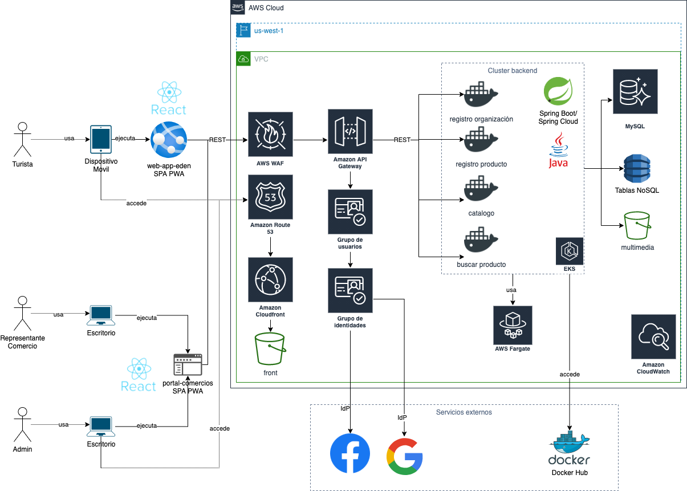

# DISEÑO DE ARQUITECTURA DE SOFTWARE PARA ELEDENAPP

## Contenido

- [Introducción](#Introducción)
- [Método](#Método)
- [Requerimientos del sistema](#Requerimientos-del-sistema)
- [Identificación y selección de conceptos de diseño](#identificación-y-selección-de-conceptos-de-diseño)
- [Producción de estructuras](#Producción-de-estructuras)
- [Definición de interfaces](#Definición-de-interfaces)
- [Vistas de arquitectura: modelo 4+1](#Vistas-de-arquitectura-modelo-4+1)
- [Evaluación con ATAM](#Evaluación-con-ATAM)
- [Referencias](#Referencias)

## Introducción

Este documento sirve como base para la creación de servicios similares dentro del equipo y como guía para los desarrolladores el entender la razón de las decisiones de diseño tomadas en el momento de la concepción del producto minimo viable para ElEdenApp. Esperamos que sea lo suficientemente claro para entender las necesidades, restricciones y demás consideraciones que nos han llevado al diseño final del servicio, el entendimiento del por qué funciona como está planteado aquí y las restricciones bajo las cuales fue desarrollado pueden servir de insumo para planear y ejecutar cambios en un futuro. 

Para el levantamiento de estos motivadores se usó un árbol de utilidad y así definir una priorización inicial de los atributos de calidad.

Se toma como base los principios del marco de trabajo Amazon Well-Architected Framework.

Se hace énfasis en habilitar la capacidad de autoservicio dentro del servicio de forma que la célula transversal no sea un cuello de botella para realizar cambios de configuración o personalizaciones propias de cada cliente del servicio.  Nuestro objetivo como servicio transversal consiste en simplificar el consumo y ocultar la complejidad asociada al consumo y orquestación de servicios de operadores de seguridad.

## Método

El método usado para la creación de la arquitectura del producto EdenApp, está dirigido por los atributos de calidad y su relación con los requerimientos del sistema. Se busca alinear al máximo los objetivos y necesidades de negocio con los capacidades técnicas a través de los requerimientos del sistema, también definir las bases que permitirán evolucionar el producto a medida que se aprende más sobre las necesidades de los usuarios.

## Requerimientos del sistema

Fuente: [./content/arquitectura/source/requerimientos.xlsx](./source/requerimientos.xlsx)

**Nota**: Si realiza un cambio en el excel de requerimientos, por favor actualice esta tabla con la herramienta [Table2Markdown](https://tabletomarkdown.com/).

*Tabla requerimientos*

TODO agregar

## Diseño de Arquitectura

La solución de arquitectura propuesta para ElEdenApp se basa en un estilo arquitectural de microservicios, permitiendo la encapsulación de responsabilidades definidas y un desacoplamiento e independencia de los servicios. Lo cual posibilita la adición o modificación de características a la arquitectura de forma ágil y sin generar indisponibilidades en la prestación de servicio o en el funcionamiento de los demás servicios.

# Alcance de la Arquitectura

El alcance de diseño de arquitectura que aquí se presenta pretende definir y detallar la arquitectura objetivo del sistema de gestión de bienes y productos de las diferentes organizaciones, para su implementación. En el producto minimo viable se detalla el diseño e implementación de una aplicación web progresiva que permite realizar una oferta de experiencias a turistas y lugareños aportando a la reactivación/crecimiento turístico del municipio. El alcance del proyecto es definir la arquitectura general de la solución la cual permite estructurar la oferta turística del municipio de La Tebaida y la implementación de una web progresiva que sirve de herramienta para tal fin. 

El producto mínimo viable de esta solución tiene como alcance la implementación del módulo de restaurantes donde se pueden realizar las siguientes funcionalidades:

 - Registro de la organización (restaurante)
 -	Creación, visualización, actualización y eliminación de la información de la organización.
 -	Home de la aplicación web progresiva.
 -	Módulo de visualización de información de restaurantes.

# Objetivos de la Arquitectura

- Generar una herramienta para la automatización del proceso de registro, gestion y publicación del contenido turistico y comercial.
- Definir una arquitectura de solución completamente nativa en nube.
- Definir una estrategia de arquitectura que asegure la disponibilidad del servicio de 99.999.
- Modelar una solución arquitectural de escalabilidad/elasticidad que asegure el crecimiento y decrecimiento del sistio en incrementos de carga.

## Diseño Guiado por Dominio (DDD)

- **DOMINIO:**
Entendido como el negocio en si, es todo aquello a lo que la alcaldia de La Tebaida hace como entidad a traves de la plataforma ElEdenApp y en consecuencia es el "problema" que se desea resolver, en este caso tener una herramienta que sirva como catalogo de los producto y servicios de las empresas del municipio. El subdominio es la estrategia que permite separar el problema en pequeñas partes funcionales, se debe clasificar en «Core» (Por lo que visita el cliente la plataforma) el cual soporta una funcionalidad para que opere la plataforma y en «soporte» y/o «generico» que son funcionalidades que pueden usarse en este u otro dominio.

- **BOUNDED CONTEXT:**
Módulo de software especifico que puede abarcar un sistema, aplicaicon o servicio comercial.

- **ENTIDAD:**
El libro de Vernon, "Implementación del diseño controlado por dominio", tiene una excelente definición de Entidad: "Diseñamos un concepto de dominio como una Entidad cuando nos preocupamos por su individualidad, cuando distinguir si de todos los objetos en un sistema es una restricción obligatoria. Una Entidad es una cosa única y es capaz de cambiar continuamente durante un largo período de tiempo". La mutabilidad y la identidad única son las dos características principales que tienen las entidades.

- **SERVICIOS:**
Los servicios siempre se exponen como una interfaz, no para "intercambiabilidad", capacidad de prueba o similares, sino para exponer un conjunto de operaciones cohesivas en forma de contrato. Un buen servicio debe cumplir estas características:
   - La operación se relaciona con un concepto de dominio que no es una parte natural de una entidad u objeto de valor.
   - La interfaz se define en términos de otros elementos del modelo de dominio.
   - La operación es independiente

Según lo anterior se proponen los siguientes servicios en los cuales podemos encapsular las funcionalidades principales para porder cumplir los objetivos de las arquitectura en el alcance planteado. Se plantea exponer la funcionalidades CRUD de una organizacion, del producto y se han implementado dos tipos de servicios que permitiran categorizar cada uno de ellos. Un catálogo de Organizaciones y de productos asi el negocio prodrá clasificarlos segun las necesidades comerciales.

En el siguiente repositorio en swagger se puede acceder a la documentación tecnica de los servicios expuestos.

http://k8s-default-edenapii-1d067437d3-2023258929.us-west-2.elb.amazonaws.com/eden-api/swagger-ui/index.html?configUrl=/eden-api/swagger-config#/catalogo-organizacion-controller/getCatalogoOrganizacionList

- **EVENT STORMING:**

Para la responsabilidad de negocio su utiliza la herramienta de [Event Storming](https://en.wikipedia.org/wiki/Event_Storming) para modelar sus dominios. A continuación, se describe cada uno de los procesos y resultado de los eventos principales del sistema.

- **ARQUITECTURA DE CONTEXTO:**

En base a las definiciones del event storming la arquitectura general estaria compuesta por modulos de difentes categorias donde podrian clasificarse las organizaciones, tales como Hoteles, Restaurantes, Transporte, o algo más particular si así el negocio lo definiera. Apartir de esta clasificación se podran definir catalogos que serviran para exponer el contenido de los bienes y productos de manera organizada segun esta clasificación.

Cada Catálogo podra estar compuesto por entidades de productos u organizaciónes segun las decisiones que requiera el negocio. Para el producto minimo viable se realizará solo los modelos referentes a catalogos de organizaciones. A continuación en el diagrama se evidencia esta organización.

## Principios de la Arquitectura

<table>
   <thead>
      <tr>
         <th rowspan=2>Nombre</th>
         <td colspan=2 align="left">Primacía de Principios</td>
      </tr>
   </thead>
   <tbody>
      <tr>
         <td align="center">Referencia</td>
         <td colspan=2>EE_P01</td>
      </tr>
      <tr>
         <td align="center">Declaración</td>
         <td colspan=2>Estos principios se aplican a todas los interesados en el proyecto. Es necesario que todo equipo o individuo cumpla con estos principios o sustente por qué no se pueden cumplir.</td>
      </tr>
      <tr>
         <td align="center">Razón Fundamental</td>
         <td colspan=2>Es la única forma en que se puede proporcionar a toda la plataforma y a sus interesados, un nivel consistente, confiable y cuantificable de información con la calidad necesaria para tomar decisiones que permitan la correcta implementación de los procesos, productos y servicios.</td>
      </tr>
      <tr>
         <td align="center">Implicaciones</td>
         <td colspan=2>Se garantiza la inclusión, coherencia y alineación continua con el negocio. Sin esto, la gestión de información, los procesos y las tecnologías se verían rápidamente afectadas, deprecanto la funcionalidad de la plataforma de ElEdénApp.</td>
      </tr>
      <tr>
         <td></td>
         <td colspan=2>Sin este principio, las exclusiones, el favoritismo y la inconsistencia debilitarían rápidamente el manejo de la información.</td>
      </tr>
        <tr>
         <td></td>
         <td colspan=2>Las iniciativas de gestión de la información no se podrían comenzar hasta que se examine el cumplimiento de todos los principios.</td>
      </tr>
        <tr>
         <td></td>
         <td colspan=2>Un conflicto con un principio se resolverá cambiando el marco de la iniciativa.</td>
      </tr>   
   </tbody>
</table>

<table>
   <thead>
      <tr>
         <th rowspan=2>Nombre</th>
         <td colspan=2 align="left">Buscar aprobación de arquitectura</td>
      </tr>
   </thead>
   <tbody>
      <tr>
         <td align="center">Referencia</td>
         <td colspan=2>EE_P02</td>
      </tr>
      <tr>
         <td align="center">Declaración</td>
         <td colspan=2>Todos los proyectos e iniciativas serán sujetos de aprobación arquitectónica en las etapas clave a lo largo de su ciclo de vida.</td>
      </tr>
      <tr>
         <td align="center">Razón Fundamental</td>
         <td colspan=2>Garantiza que los proyectos y procesos se implementen y operen de manera articulada con los ya establecidos. Controla y previene la desintegración y divergencia de la estrategia de negocio que tiene la plataforma ElEdenApp y el objetivo operativo que requiere la alcaldía de La Tebaida.</td>
      </tr>
      <tr>
         <td align="center">Implicaciones</td>
         <td colspan=2>Todos los proyectos deben estar alineados a la estrategia de la plataforma ElEdenApp y los objetivos de la alcaldía de La Tebaida.</td>
      </tr>
      <tr>
         <td></td>
         <td colspan=2>Los proyectos deben tener una justificación comercial coherente si estos requieren realizar algún cambio en la arquitectura o definiciones ya establecidas.</td>
      </tr>
        <tr>
         <td></td>
         <td colspan=2>Pueden existir excepciones en la aprobación, mientras se logra establecer una fecha futura cercana a través de un plan de acción aprobado por el comité de arquitectura.</td>
      </tr>
        <tr>
         <td></td>
         <td colspan=2>Las excepciones se otorgarían por un tiempo limitado.</td>
      </tr>   
   </tbody>
</table>

<table>
   <thead>
      <tr>
         <th rowspan=2>Nombre</th>
         <td colspan=2 align="left">Recursos compartidos</td>
      </tr>
   </thead>
   <tbody>
      <tr>
         <td align="center">Referencia</td>
         <td colspan=2>EE_P03</td>
      </tr>
      <tr>
         <td align="center">Declaración</td>
         <td colspan=2>Las aplicaciones, los componentes del sistema, la infraestructura y los datos, se reutilizarán siempre que sea posible, se comprarán como soluciones básicas si esto es requerido y solo se construirán si existe un requisito único que de otro modo no se podría cumplir.</td>
      </tr>
      <tr>
         <td align="center">Razón Fundamental</td>
         <td colspan=2>Proporciona una buena relación calidad-precio al simplificar el inventario de los recursos TIC, reduciendo la duplicación de datos y adoptando procesos comerciales comunes.</td>
      </tr>
      <tr>
         <td align="center">Implicaciones</td>
         <td colspan=2>Se debe realizar una definición de los impactos y riesgos en la utilización y operación de recursos compartidos, permitiendo maximizar el valor y reduciendo la complejidad.</td>
      </tr>
      <tr>
         <td></td>
         <td colspan=2>La financiación de los programas y proyectos deben realizar un análisis presupuestal con los servicios y sistemas compartidos para evitar duplicación innecesaria de los recursos TIC.</td>
      </tr>
   </tbody>
</table>

### Principios de Negocio

<table>
   <thead>
      <tr>
         <th rowspan=2>Nombre</th>
         <td colspan=2 align="left">Continuidad del negocio</td>
      </tr>
   </thead>
   <tbody>
      <tr>
         <td align="center">Referencia</td>
         <td colspan=2>EE_PN01</td>
      </tr>
      <tr>
         <td align="center">Declaración</td>
         <td colspan=2>Las operaciones de la plataforma ElEdenApp deben seguir ejecutándose sin importar las interrupciones de los sistemas de información.</td>
      </tr>
      <tr>
         <td align="center">Razón Fundamental</td>
         <td colspan=2>La dependencia del negocio a los sistemas de información es sumamente alta por lo cual se deben contemplar la confiablidad de estos desde su diseño. Las unidades comerciales, de turismo o de negocio en la Tebaida deben estar en capacidad de operar con mecanismos alternos a los sistemas de información.</td>
      </tr>
      <tr>
         <td align="center">Implicaciones</td>
         <td colspan=2>Los sistemas de información de la plataforma deben evaluarse para establecer su criticidad e impacto en los objetivos de la organización, en pro de determinar el nivel de continuidad que es requerido y el plan de recuperación en caso de que sea necesario.</td>
      </tr>
      <tr>
         <td></td>
         <td colspan=2>Los planes de redundancia y recuperación deben ser tenidos en cuenta al momento del diseño de los sistemas de información.</td>
      </tr>
        <tr>
         <td></td>
         <td colspan=2>La gestión de riesgos de operación debe incluir parchado y actualización de los sistemas de información de ElEdenApp.</td>
      </tr>
   </tbody>
</table>

<table>
   <thead>
      <tr>
         <th rowspan=2>Nombre</th>
         <td colspan=2 align="left">Arquitectura Orientada al Servicio</td>
      </tr>
   </thead>
   <tbody>
      <tr>
         <td align="center">Referencia</td>
         <td colspan=2>EE_PN02</td>
      </tr>
      <tr>
         <td align="center">Declaración</td>
         <td colspan=2>La arquitectura Empresarial de ElEdenApp estará implementada bajo el diseño de servicios que implementen funciones de negocio del mundo real y que comprometan los procesos de negocio de las organizaciones. Los sistemas de Información deberán ser modulares con componentes de sistemas individuales que son integradas por servicios.</td>
      </tr>
      <tr>
         <td align="center">Razón Fundamental</td>
         <td colspan=2>La arquitectura orientada al servicio permite entregar agilidad al interior de la plataforma y un flujo de información sin límites.</td>
      </tr>
      <tr>
         <td align="center">Implicaciones</td>
         <td colspan=2>La orientación al servicio coloca requisitos únicos sobre infraestructura/software y deberá usar estándares o protocolos abiertos que permitan la interoperabilidad.</td>
      </tr>
      <tr>
         <td></td>
         <td colspan=2>Los sistemas de información son separados en componentes. Operación independiente de cada componente.</td>
      </tr>
        <tr>
         <td></td>
         <td colspan=2>Cada componente desconocerá la existencia de otro componente. Los componentes se comunicarán con cada otro mediante servicios interoperables usando el protocolo seguro. Fuerte gobierno para la representación e implementación del servicio.</td>
      </tr>   
   </tbody>
</table>

<table>
   <thead>
      <tr>
         <th rowspan=2>Nombre</th>
         <td colspan=2 align="left">Cumplimiento de Estándares y Leyes</td>
      </tr>
   </thead>
   <tbody>
      <tr>
         <td align="center">Referencia</td>
         <td colspan=2>EE_PN03</td>
      </tr>
      <tr>
         <td align="center">Declaración</td>
         <td colspan=2>Los procesos de información y de operación de ElEdenApp deben cumplir con las políticas y regulaciones de contenido y publicidad.</td>
      </tr>
      <tr>
         <td align="center">Razón Fundamental</td>
         <td colspan=2>Las políticas internas de la plataforma deben cumplir con las normas de los diferentes entes de control del país en que se opera el sector del turismo, transporte y comercio</td>
      </tr>
      <tr>
         <td align="center">Implicaciones</td>
         <td colspan=2>La organización deberá asegurar que cumple con las normas existentes relacionados a la gestión, colección y el tiempo de retención de la información.</td>
      </tr>
      <tr>
         <td></td>
         <td colspan=2>Cambios en la regulación y normatividad tenderán a liderar cambios en los procesos, aplicación o forma de operación.</td>
      </tr>
        <tr>
         <td></td>
         <td colspan=2>Acceso rápido y educación a las normas/regulaciones existentes.</td>
      </tr>
   </tbody>
</table>

### Principios de Información

<table>
   <thead>
      <tr>
         <th rowspan=2>Nombre</th>
         <td colspan=2 align="left">Calidad de datos</td>
      </tr>
   </thead>
   <tbody>
      <tr>
         <td align="center">Referencia</td>
         <td colspan=2>EE_PI01</td>
      </tr>
      <tr>
         <td align="center">Declaración</td>
         <td colspan=2>Cada elemento de datos tiene un vigilante responsable de la calidad de los datos.</td>
      </tr>
      <tr>
         <td align="center">Razón Fundamental</td>
         <td colspan=2>Uno de los beneficios de un entorno arquitectónico es la capacidad de publicar información (por ejemplo, texto, imagen, etc.) en toda la plataforma. A medida que crece el grado de intercambio de datos y las unidades de negocio dependen de información común, se hace esencial que solo el vigilante de datos tome decisiones sobre el contenido de los datos. Dado que los datos pueden perder su integridad cuando se ingresan varias veces, el vigilante de datos tendrá la tarea exclusiva de la entrada de datos que elimina el esfuerzo humano redundante y los recursos de almacenamiento de datos.
Nota: Un vigilante es diferente a un administrador: un administrador es responsable de la precisión y actualización de los datos, mientras que las responsabilidades de un vigilante pueden ser más amplias e incluir tareas de definición y estandarización de datos.</td>
      </tr>
      <tr>
         <td align="center">Implicaciones</td>
         <td colspan=2>El vigilante disuelve los problemas de "propiedad" de los datos y permite que los datos estén disponibles para satisfacer las necesidades de todos los usuarios. Esto implica que puede ser necesario un cambio cultural de "propiedad" de datos a "custodia de datos".</td>
      </tr>
      <tr>
         <td></td>
         <td colspan=2>El vigilante de datos será responsable de cumplir con los requisitos de calidad aplicados a los datos.</td>
      </tr>
        <tr>
         <td></td>
         <td colspan=2>Es esencial que el vigilante tenga la capacidad de proporcionar confianza al usuario de los datos en atributos tales como la "fuente de datos"</td>
      </tr>
        <tr>
         <td></td>
         <td colspan=2>Es esencial identificar la verdadera fuente de los datos para que a la autoría de datos pueda ser asignado. Esto no significa que las fuentes clasificadas serán reveladas, ni tampoco significa que la fuente será el vigilante.</td>
      </tr>   
   </tbody>
</table>

<table>
   <thead>
      <tr>
         <th rowspan=2>Nombre</th>
         <td colspan=2 align="left">Lenguaje ubicuo y definición de datos</td>
      </tr>
   </thead>
   <tbody>
      <tr>
         <td align="center">Referencia</td>
         <td colspan=2>EE_PI02</td>
      </tr>
      <tr>
         <td align="center">Declaración</td>
         <td colspan=2>Los datos se definen de manera consistente para toda la plataforma del ElEdenApp, sus definiciones son comprensibles y están disponibles para todos los usuarios en un lenguaje común.</td>
      </tr>
      <tr>
         <td align="center">Razón Fundamental</td>
         <td colspan=2>Los datos que se utilizarán en el desarrollo de aplicaciones deben tener una definición común en toda la organización para permitir el intercambio de datos. Un vocabulario común facilitará las comunicaciones y permitirá que el diálogo sea efectivo. Además, se requiere para interconectar sistemas e intercambiar datos.</td>
      </tr>
      <tr>
         <td align="center">Implicaciones</td>
         <td colspan=2>Tenemos que pensar que este problema se aborda adecuadamente porque hay personas con cargo de "administración de datos" que implican mayor responsabilidad.</td>
      </tr>
      <tr>
         <td></td>
         <td colspan=2>Se debe comprometer energía y recursos adicionales significativos para esta tarea. Es clave para el éxito los esfuerzos para mejorar el entorno de información. Esto está separado pero relacionado con el tema de la definición de elementos de datos, que es abordado por una comunidad amplia; esto es más como definiciones y vocabularios comunes.</td>
      </tr>
        <tr>
         <td></td>
         <td colspan=2>Se debe establecer un vocabulario común inicial para el negocio; las definiciones se usarán de manera uniforme en toda la plataforma. Siempre que se requiera una nueva definición de datos, el esfuerzo de definición se coordinará y se conciliará entre las partes involucradas siempre teniendo la desición final el negocio.</td>
      </tr>
        <tr>
         <td></td>
         <td colspan=2>Las ambigüedades resultantes de múltiples definiciones de datos deben dar paso a definiciones aceptadas en toda la empresa y su comprensión.
Se deben asignar responsabilidades de administración de datos funcionales. Se deben coordinar múltiples iniciativas de estandarización de datos.</td>
      </tr>   
   </tbody>
</table>

### Principios de Aplicación

<table>
   <thead>
      <tr>
         <th rowspan=2>Nombre</th>
         <td colspan=2 align="left">Facilidad de uso</td>
      </tr>
   </thead>
   <tbody>
      <tr>
         <td align="center">Referencia</td>
         <td colspan=2>EE_PA01</td>
      </tr>
      <tr>
         <td align="center">Declaración</td>
         <td colspan=2>Las aplicaciones son fáciles de usar. La tecnología subyacente es transparente para los usuarios, por lo que pueden concentrarse en las tareas que tienen que desarrollar.</td>
      </tr>
      <tr>
         <td align="center">Razón Fundamental</td>
         <td colspan=2>Cuanto más un usuario tiene que entender la tecnología subyacente, menos productivo es ese usuario. La facilidad de uso es un incentivo positivo para el uso de aplicaciones. Alienta a los usuarios a trabajar dentro del entorno de información integrado en lugar de desarrollar sistemas aislados para realizar la tarea fuera del entorno de información integrado de Toures Balón. La mayor parte del conocimiento requerido para operar un sistema será similar a otros. La capacitación se mantiene al mínimo, y el riesgo de usar un sistema de manera inadecuada es bajo. El uso de una aplicación debe ser tan intuitivo como el usar un celular diferente.</td>
      </tr>
      <tr>
         <td align="center">Implicaciones</td>
         <td colspan=2>Se requerirá que las aplicaciones tengan un "aspecto y sensación" comunes y que cumplan con los requisitos ergonómicos; por lo tanto, debe diseñarse el estándar común de apariencia y sensación según las definiciones de la dirección de Mercadeo y el área de Experiencia de Usuario de Toures Balón y deben desarrollarse criterios de prueba de usabilidad.</td>
      </tr>
      <tr>
         <td></td>
         <td colspan=2>Las pautas para las interfaces de usuario no deben estar limitadas por suposiciones sobre la ubicación del usuario, el idioma, la capacitación de los sistemas o la capacidad física.</td>
      </tr>
        <tr>
         <td></td>
         <td colspan=2>Factores como la lingüística, las enfermedades físicas del cliente (agudeza visual, la capacidad de usar el teclado/ratón) y la competencia en el uso de la tecnología tienen amplias ramificaciones para determinar la facilidad de uso de una aplicación.</td>
      </tr>
   </tbody>
</table>

<table>
   <thead>
      <tr>
         <th rowspan=2>Nombre</th>
         <td colspan=2 align="left">Diseñar aplicaciones para conocer las necesidades del usuario.</td>
      </tr>
   </thead>
   <tbody>
      <tr>
         <td align="center">Referencia</td>
         <td colspan=2>EE_PA02</td>
      </tr>
      <tr>
         <td align="center">Declaración</td>
         <td colspan=2>Las necesidades del usuario se descubrirán a partir de la participación directa con los usuarios y la evidencia recopilada sobre el uso de los servicios existentes.</td>
      </tr>
      <tr>
         <td align="center">Razón Fundamental</td>
         <td colspan=2>Comprender las necesidades de los usuarios, qué funciones y características utilizan regularmente en los servicios existentes ayuda a priorizar y planificar la entrega de nuevos servicios y realizar cambios en los existentes.</td>
      </tr>
      <tr>
         <td align="center">Implicaciones</td>
         <td colspan=2>Se requerirá un pequeño equipo compuesto por partes interesadas y personal técnico. Se requerirá experiencia en consultoría de experiencia de usuario (UX).</td>
      </tr>
      <tr>
         <td></td>
         <td colspan=2>Se requerirá realizar un análisis y clasificación de las peticiones, quejas y reclamos interpuestas por lo clientes con la intención de identificar la principal necesidad 2que se deberán satisfacer.</td>
      </tr>
   </tbody>
</table>

<table>
   <thead>
      <tr>
         <th rowspan=2>Nombre</th>
         <td colspan=2 align="left">Independencia tecnológica</td>
      </tr>
   </thead>
   <tbody>
      <tr>
         <td align="center">Referencia</td>
         <td colspan=2>EE_PA03</td>
      </tr>
      <tr>
         <td align="center">Declaración</td>
         <td colspan=2>Las aplicaciones son independientes de las opciones tecnológicas específicas y, por lo tanto, pueden operar en una variedad de plataformas tecnológicas.</td>
      </tr>
      <tr>
         <td align="center">Razón Fundamental</td>
         <td colspan=2>La independencia de las aplicaciones de la tecnología subyacente permite que se puedan desarrollar, actualizar y operar de la manera más rentable y oportuna. De lo contrario, la tecnología que está sujeta a la obsolescencia y la dependencia del proveedor, se convierte en una necesidad más importante que los requerimientos del usuario. Al darse cuenta de que cada decisión tomada con respecto a TI nos hace depender de esa tecnología, la intención de este principio es asegurar que las aplicaciones no dependan de hardware específico y software de sistemas operativos.</td>
      </tr>
      <tr>
         <td align="center">Implicaciones</td>
         <td colspan=2>Este principio requerirá estándares que admitan la portabilidad.</td>
      </tr>
      <tr>
         <td></td>
         <td colspan=2>Las interfaces del subsistema deberán desarrollarse para permitir que las aplicaciones heredadas interactúen con las aplicaciones y los entornos operativos desarrollados bajo la Arquitectura Empresarial.</td>
      </tr>
        <tr>
         <td></td>
         <td colspan=2>La mediación debe usarse para desacoplar aplicaciones de soluciones de software específicas.</td>
      </tr>
   </tbody>
</table>

### Principios de Tecnología
 
 <table>
   <thead>
      <tr>
         <th rowspan=2>Nombre</th>
         <td colspan=2 align="left">Interoperabilidad de sistemas</td>
      </tr>
   </thead>
   <tbody>
      <tr>
         <td align="center">Referencia</td>
         <td colspan=2>EE_PT01</td>
      </tr>
      <tr>
         <td align="center">Declaración</td>
         <td colspan=2>El Software y Hardware de la plataforma ElEdpen deben seguir estándares que promuevan la interoperabilidad de datos, aplicaciones y tecnología. Adherirse a este principio facilita la integración de sistemas de información y soporte de diferentes proveedores de Software y Hardware.</td>
      </tr>
      <tr>
         <td align="center">Razón Fundamental</td>
         <td colspan=2>Este principio permite proteger las inversiones actuales de TI maximizando el retorno de inversión (ROI) y la reducción de costos del ElEdenApp asociados a la dependencia de un proveedor de telecomunicaciones o de software.</td>
      </tr>
      <tr>
         <td align="center">Implicaciones</td>
         <td colspan=2>Estándares de integración y de industria deben seguirse, a menos que exista una razón convincente de negocio para implementar una solución no estandarizada.</td>
      </tr>
      <tr>
         <td></td>
         <td colspan=2>El software y hardware actuales deben ser identificadas y documentadas.</td>
      </tr>
        <tr>
         <td></td>
         <td colspan=2>Se debe establecer un proceso que permita analizar estándares y excepciones.</td>
      </tr> 
   </tbody>
</table>

## VISTAS DE ARQUITECTURA - MODELO 4 + 1

## Vista de Escenarios

<table>
   <thead>
      <tr>
         <th rowspan=2>FIABILIDAD</th>
         <td colspan=2 align="left">Capacidad de un sistema o componente para desempeñar  las funciones especificadas, cuando se usa bajo unas condiciones y periodo de tiempo determinados.</td>
      </tr>
      <tr>
         <th>DISPONIBILIDAD</th>
         <td align="left">Capacidad del sistema o componente de estar operativo y accesible para su uso cuando se requiere</td>
      </tr>
   </thead>
   <tbody>
      <tr>
         <td align="center">1</td>
         <td colspan=2>¿Cuanto tiempo esperamos soportar ante la indisponibildiad de un proveedor?</td>
      </tr>
      <tr>
         <td align="center">2</td>
         <td colspan=2>¿Que estrategia se realizará para garantizar la dispoinilidad de .999?</td>
      </tr>
      <tr>
         <td align="center">3</td>
         <td colspan=2>¿Que estrategia se realizará para cumplir el tiempo medio de reparacion del sistema (5 minutos) ante una caida?</td>
      </tr>
      <tr>
         <td align="center">4</td>
         <td colspan=2>¿Que estrategia se realizará si el sistema del proveedor no se encuentra disponible?</td>
      </tr>
      <tr>
         <td align="center">5</td>
         <td colspan=2>¿Como se asegura la disponibildiad de los datos?</td>
      </tr>
      <tr>
         <td align="center">6</td>
         <td colspan=2>¿Que tipo de redudancia se utilizará en la arquitectura y cómo se seleccion que componentes deben ser redundantes?</td>
      </tr>
      <tr>
         <td></td>
         <td><b>TOLERANCIA A FALLOS<b></td>
         <td>Capacidad del sistema o componente para operar según lo previsto en presencia de fallos hardware o software.</td>
      </tr>
      <tr>
         <td align="center">1</td>
         <td colspan=2>¿Como se realizará la identifiacion de los fallos?</td>
      </tr>
      <tr>
         <td align="center">2</td>
         <td colspan=2>¿Como se comportaria el sistema ante una falla masiva?</td>
      </tr>
      <tr>
         <td align="center">3</td>
         <td colspan=2>¿Como se comportaria el sistema ante una falla de los sistemas del proveedor?</td>
      </tr>
      <tr>
         <td align="center">4</td>
         <td colspan=2>¿Como se comportaria el sistema ante una falla de la capa de red?</td>
      </tr>
      <tr>
         <td align="center">5</td>
         <td colspan=2>¿Como se comportaria el sistema ante una falla en la capacidad de los servidores?</td>
      </tr>
      <tr>
         <td align="center">6</td>
         <td colspan=2>¿Como se comportaria el sistema ante la caida de un componente?</td>
      </tr>
      <tr>
         <th rowspan=2>PORTABILIDAD</th>
         <td colspan=2 align="left">Capacidad del producto o componente de ser transferido de forma efectiva y eficiente de un entorno hardware, software, operacional o de utilización a otro.</td>
      </tr>
      <tr>
         <th>ADAPTABILIDAD</th>
         <td align="left">Capacidad del producto que le permite ser adaptado de forma efectiva y eficiente a diferentes entornos determinados de hardware, software, operacionales o de uso.</td>
      </tr>
      <tr>
         <td align="center">1</td>
         <td colspan=2>¿Cuales protocolos utilizaremos para integrarnos con los proveedores?</td>
      </tr>
      <tr>
         <td align="center">2</td>
         <td colspan=2>¿Qué estandares de comunicación utilizaremos internamente?</td>
      </tr>
      <tr>
         <td align="center">3</td>
         <td colspan=2>¿Cual es la mejor estrategia para realizar una comunicacion entre los componentes de manera adaptable?</td>
      </tr>
      <tr>
         <td align="center">4</td>
         <td colspan=2>¿A que componentes somos adaptables y a que componentes no somos adaptables?</td>
      </tr>
      <tr>
         <td align="center">5</td>
         <td colspan=2>¿Que esfuerzo requerira adaptar un nuevo componente sin encesidad de cambiar la definicion de la arquitectura?</td>
      </tr>
      <tr>
         <td align="center">6</td>
         <td colspan=2>¿Si un proveedor cambiara su estandar de integracion que tanto afectara nuestra arquitectura?</td>
      </tr>
      <tr>
         <td></td>
         <th>CONFIGURABILIDAD</th>
         <td align="left">capacidad de cambiar los parámetros operativos de un sistema sin escribir código.</td>
      </tr>
      <tr>
         <td align="center">1</td>
         <td colspan=2>¿Que componentes y procesos se deben/pueden/no deben configirarse?</td>
      </tr>
      <tr>
         <td align="center">2</td>
         <td colspan=2>¿Cual es el alcance de las configuraciones sobre la definicion de la arquitectura?</td>
      </tr>
      <tr>
         <td align="center">3</td>
         <td colspan=2>¿Cómo se garantiza que los usuarios adecuados puedan hacer configuraciones sensibles del sistema? </td>
      </tr>
      <tr>
         <td align="center">4</td>
         <td colspan=2>¿Como se realizaran las configuraciones?</td>
      </tr>
      <tr>
         <td align="center">5</td>
         <td colspan=2>¿Como se asegurara que al ralizar una configuracion no se afectara el sistema?</td>
      </tr>
      <tr>
         <td align="center">6</td>
         <td colspan=2>¿Se pueden hacer cambios sin necesidad de reiniciar el sistema?</td>
      </tr>
      <tr>
         <td align="center">7</td>
         <td colspan=2>¿Como se asegura que el realizar cambios en la configuracion en cualqueir horario no impacte la operación del sistema y del negocio?</td>
      </tr>
      <tr>
         <td align="center">8</td>
         <td colspan=2>¿Que configuración se realizará en la infraestrcutura para operar ante la indisponibildiad de un servidor/componente?</td>
      </tr>
      <tr>
         <th rowspan=2>MANTENIBILIDAD</th>
         <td colspan=2 align="left">Esta característica representa la capacidad del producto software para ser modificado efectiva y eficientemente, debido a necesidades evolutivas, correctivas o perfectivas.</td>
      </tr>
      <tr>
         <th>MODIFICABILIDAD</th>
         <td align="left">Capacidad del producto que permite que sea modificado de forma efectiva y eficiente sin introducir defectos o degradar el desempeño.</td>
      </tr>
      <tr>
         <td align="center">1</td>
         <td colspan=2>¿Que impacto tiene el sistema ante el cambio de uno de sus componentes?</td>
      </tr>
      <tr>
         <td align="center">2</td>
         <td colspan=2>¿ante el cambio de un componente del sistema como se garantiza su interiorabildiad?</td>
      </tr>
      <tr>
         <td align="center">3</td>
         <td colspan=2>¿Como se garantizara que el cambio del componente actualice/no impacte los respositorios de datos del sistema?</td>
      </tr>
      <tr>
         <td align="center">4</td>
         <td colspan=2>¿Como se asegura que el realizar cambios en los componentes en cualqueir horario no impacte la operación del sistema y del negocio?</td>
      </tr>
      <tr>
         <td align="center">5</td>
         <td colspan=2>Si esta arquitectura incluye un repositorio de datos, ¿cuántas ubicaciones distintas en la arquitectura tienen conocimiento directo de sus tipos de datos y diseño?</td>
      </tr>
      <tr>
         <td align="center">6</td>
         <td colspan=2>Si cambia un tipo comando, artefacto o un mensajes, ¿cuántas partes de la arquitectura se ven afectadas?</td>
      </tr>
      <tr>
         <td></td>
         <th>MODULARIDAD</th>
         <td align="left">Capacidad de un sistema o programa de ordenador (compuesto de componentes discretos) que permite que un cambio en un componente tenga un impacto mínimo en los demás.</td>
      </tr>
      <tr>
         <td align="center">1</td>
         <td colspan=2>¿Ante la necesidad del cambio de un componente cuantas funcinalidades/artefactos de negocio/tecnicas se estan afectando?</td>
      </tr>
      <tr>
         <td align="center">2</td>
         <td colspan=2>¿Que estrategia se realizará para asegurar que un modulo no realice mas de dos respondabilidades?</td>
      </tr>
      <tr>
         <td align="center">3</td>
         <td colspan=2>¿que estrategia se realizara para asegurar la conhesión de los componentes del sistema?</td>
      </tr>
      <tr>
         <td align="center">4</td>
         <td colspan=2>¿Como se asegura que el cambio en un componente del sistema no afecte a operabilidad del mismo?</td>
      </tr>
      <tr>
         <th rowspan=2>EFICIENCIA DE DESEMPEÑO</th>
         <td colspan=2 align="left">Esta característica representa el desempeño relativo a la cantidad de recursos utilizados bajo determinadas condiciones. </td>
      </tr>
      <tr>
         <th>COMPORTAMIENTO TEMPORAL</th>
         <td align="left">Los tiempos de respuesta y procesamiento y los ratios de throughput de un sistema cuando lleva a cabo sus funciones bajo condiciones determinadas en relación con un banco de pruebas (benchmark) establecido.</td>
      </tr>
      <tr>
         <td align="center">1</td>
         <td colspan=2>¿Cuál es el impacto en el rendimiento en la integracion de un proveedor delgado frente a uno pesado?</td>
      </tr>
      <tr>
         <td align="center">2</td>
         <td colspan=2>¿Cual es la estrategia que garantizará la distribucion y el equilibrio de la carga de hits en el sistema?</td>
      </tr>
      <tr>
         <td align="center">3</td>
         <td colspan=2>Si varios mensajes de eventos llegan a una cola de mensajes compartida, ¿cuál es la estrategia de priorización en el procesamiento/atención? </td>
      </tr>
      <tr>
         <td></td>
         <th>UTILIZACIÓN DE RECURSOS</th>
         <td align="left">Las cantidades y tipos de recursos utilizados cuando el software lleva a cabo su función bajo condiciones determinadas.</td>
      </tr>
      <tr>
         <td align="center">1</td>
         <td colspan=2>¿Que componentes/artefactos utilizan un protocolo de comunicacion sincrónico o asincrónico?</td>
      </tr>
      <tr>
         <td align="center">2</td>
         <td colspan=2>¿Qué información se debe almacenar en caché o cual se debe persistir?</td>
      </tr>
      <tr>
         <td align="center">3</td>
         <td colspan=2>¿Si hay varios procesos que compiten por un recurso compartido, ¿cómo se asignan las prioridades a estos procesos y al proceso que controla el recurso?</td>
      </tr>
      <tr>
         <td align="center">4</td>
         <td colspan=2>¿Cuál es la ubicación física del hardware y su conectividad?</td>
      </tr>
      <tr>
         <td></td>
         <th>CAPACIDAD</th>
         <td align="left">Grado en que los límites máximos de un parámetro de un producto o sistema software cumplen con los requisitos.</td>
      </tr>
      <tr>
         <td align="center">1</td>
         <td colspan=2>¿Cuáles deben ser las características del ancho de banda de la red de comunicación para garantizar la interoperabilidad efectiva del sistema?</td>
      </tr>
      <tr>
         <td align="center">2</td>
         <td colspan=2>¿Cómo caracterizamos la carga de clientes? (por ejemplo, cuántas sesiones concurrentes, cuántos usuarios)?</td>
      </tr>
   </tbody>
</table>

### Modelo de Casos de Uso

A continuación, se definen los principales roles que a tráves del event storming se lograron identificar:

| Rol | Descripción |
| --- | --- |
| Turista | Consultar los productos y servicios de la oferta turistica y comercial del municipio de La Tebaida |
| Dueño de Organización | Crear y gestionar los recursos que permitan dar a conocer los productos y servicios a los turistas de una o mas organizaciones a su nombre. |
| Administrador | Crear y gestionar categorias de empresa y de productos, así como de gestionar la visibilidad de sus contenidos en la plataforma. |

### Escenarios de atributos de calidad

Debido a que son tablas complejas, preferimos que se remita a la fuenta para revisarlas.

Fuente: [./content/arquitectura/source/requerimientos.xlsx - Hoja "escenarios"](./source/requerimientos.xlsx)

### Restricciones

De negocio:

Tecnológicos: 

Otros:

### Preocupaciones arquitectónicas

- Manejo de la configuración del servicio

- Manejo de secretos del servicio

- Observabilidad

- Definición de métricas

- Trazabilidad

- Lineamientos de auditoría por registros.

Gestión de errores y excepciones

Procesamiento secuencial. Problemas de contingencia que afecten la escalabilidad

*P-001: Fácil de operar y auditar*

Se debe poder rastrear el estado de las peticiones, registro de casos excepcionales, errores técnicos y errores de negocio para facilitar la resolución de problemas en ambiente de producción.

*P-002: Fácil de mantener*

El servicio debe poderse adaptar a las necesidades del negocio y ser modificado rápidamente (TODO definir cuanto tiempo estimado base) por el equipo de desarrollo.

 

## Identificación y selección de conceptos de diseño

### Arquitectura de referencia

Estilo de arquitectura nuclear y patrones complementarios

### Patrones de arquitectura

Patrones de diseño 
Basado en los patrones descritos en el libro [Microservices Pattern: A pattern language for microservices](https://microservices.io/patterns/) , [Cloud design patterns - Azure Architecture Center](https://docs.microsoft.com/en-us/azure/architecture/patterns/), [SOA Design Patterns](https://patterns.arcitura.com/soa-patterns).

Fuente: [./content/arquitectura/source/requerimientos.xlsx - Hoja "patrones"](./source/requerimientos.xlsx)

**Nota**: Si realiza un cambio en el excel de requerimientos, por favor actualice esta tabla con la herramienta [Table2Markdown](https://tabletomarkdown.com/)

Tabla Patrones de diseño seleccionados para EdenApp

TODO agregar tabla

## Producción de estructuras

### Estructura global

En este diagrama se muestra una visión global del sistema:

### Identificación de estructuras que soporten la funcionalidad principal

#### Modelo de dominio de alto nivel

En la descomposición de la funcionalidad nos guiaremos con los siguientes principios:

- *Single Responsability Principle*: Una clase debe tener solo una razón para cambiar. En nuestro caso aplica para los componentes/funciones internas del servicio.

- *Common Closure Principle*: Las funciones dentro de la misma capa deben estar lo suficientemente juntas contra el mismo tipo de cambio. Un cambio en la capa afecta todos los componentes en esa capa. 

Restricciones de la descomposición:

Latencia de red

Disponibilidad limitada debido a la comunicación síncrona.

TODO agregar tabla de descompisción de funcionalidad.

## Definición de interfaces

### Interfaces externas

Externamente las interfaces UI deben ser creadas con [React](https://reactjs.org/) para dos tipos de usuarios diferentes:

- Aplicación [PWA](https://developers.google.com/web/ilt/pwa/) con un enfoque [Mobile-first](https://medium.com/@Vincentxia77/what-is-mobile-first-design-why-its-important-how-to-make-it-7d3cf2e29d00) para usuarios finales, en este caso visitantes o turistas.

Los diseños de las vistas creados en Figma los puede ver [aquí](https://www.figma.com/proto/LLRFtLkKFzHDbscyIO0lD9/Prototipo-Copy?node-id=582%3A245&scaling=min-zoom&page-id=0%3A1)

- Portal de administración para usuarios finales, en este caso dueños de comercio o administradores.

Los diseños de las vistas creados en Figma los puede ver [aquí](TODO )

### Interfaces internas

#### Estrategia de diseño API-first

Con el fin de agilizar la participación de los interesados en consumir este servicio e integrar las valiosos aportes que estos nos pueden proveer durante el proceso de desarrollo e implementación se propone la estrategia de diseño API-first en donde el equipo se concentra en definir las interfaces a través de las cuales se expondrán las capacidades de los servicios Backend a la aplicación PWA para clientes y el Portal de administración.

El uso de un estilo REST para la interfaz y OpenAPI, impacta AC-4: Interoperabilidad y AC-7: Capacidad de aprendizaje.

- Puede consultar las API aquí: TODO agregar link de interfaz swagger.

## Vistas de arquitectura: modelo 4+1

Para la documentación de la arquitectura el equipo se decantó por el modelo 4+1 por ser el mas aceptado y manejado dentro de la industria, ademas de la experiencia que tienen los integrantes del equipo con este tipo de vistas.

La herramienta para la creación de los diagramas es [draw.io](https://draw.io), no es la mas apropiada para realizar este tipo de diagramas, sin embargo nuestro enfoque es la practicidad ademas de ser una herramienta disponible y facil de usar para cualquier persona que deseé modificar y actualizar las vistas.

### Vista lógica

### Vista de procesos

Para mayor detalle puede visitar [Procesos de negocio](../procesos/procesos-negocio.md)

### Vista física

### Vista de desarrollo

### Vista de Escenarios

## Evaluación con ATAM

TODO evaluación ATAM, Workshop interno, grabarlo y subirlo al classroom.

## Restricciones

| **CÓDIGO** | **DESCRIPCIÓN** |
| --- | --- |
| R001 | Cada proveedor, independientemente de su tipo utiliza diferentes mecanismos de interacción |
| R002 | Es fundamental que el proceso no se vea viciado con ninguna decisión de tecnología |
| R003 | Los proveedores pueden no estar disponibles o variar con el tiempo |
| R004 | Capacidad de cambiar condiciones o reglas de negocio sin tener que re-desplegar el sistema |
| R005 | Capacidad de respuesta de las funcionalidades del negocio para temporadas altas |
| R006 | Soporte de canales de atención a través de la Web, dispositivos móviles y nuevas interfaces de interacción |
| R007 | Soporte de operación del negocio 24x7x365, se espera disponibilidad del 99.999 |
| R008 | Las peticiones de consulta de productos no deben tardar más de 1.5 segundos promedio por usuario. |
| R009 | Ninguna petición puede tardar más de 3 segundos por usuario. |
| R010 | El servicio de pagos debe soportar pagos por VISA, MasterCard, AMEX, Discover y PayPal. |

## Requisitos

| **CÓDIGO** | **DESCRIPCIÓN** |
| --- | --- |
| RQ001 | La implementación de los proveedores y su interacción con el proceso sea desacoplada. Esto apoyado por servicios federados que interactúen como abstracciones para el proceso. |
| RQ002 | Integrar nuevos proveedores debe tener el menor impacto para la arquitectura y sus componentes, limitando los componentes que deben verse modificados. Preferiblemente un nuevo proveedor debería ser plug & play para tecnologías que ya son soportadas. |
| RQ003 | Dependiendo de la negociación con el proveedor, estos pueden tener un mayor peso cuando se está realizando las búsquedas de opciones, de manera que se puedan ofrecer como los preferidos. Esos valores pueden cambiar dinámicamente dependiendo de nuevas condiciones de negocio. |
| RQ004 | La forma en que se debe mostrar los resultados debe tener en cuenta: Peso del convenio 50% (1-10) + Calificación de los usuarios 50% (1-10). Los porcentajes pueden cambiar con el tiempo. |
| RQ005 | La comunicación con los proveedores puede tardar algunos segundos, así que se espera que se pueda realizar una comunicación en paralelo para poder así aprovechar mejor los recursos de cómputo y también como manejar los fallos. |
| RQ006 | Análisis de datos sobre el comportamiento de los visitantes del sitio para procesos de mejora de la experiencia de usuario y campañas comerciales |
| RQ007 | El sitio debe soportar Full-Text Search en la búsqueda de productos. Debe soportar resultados similares para nunca mostrar 0 resultados |
| RQ008 | El sitio debe ser responsive, este requerimiento tienen prioridad sobre cualquier desarrollo de app móvil |
| RQ009 | El sistema debe poder satisfacer los incrementos de la demanda sin sacrificar su capacidad de respuesta, en otras palabra, atender a 100 usuario o 100 mil usuarios debería ser equivalente |
| RQ0010 | La aplicación en general debe estar libre de al menos el Top 10 de riesgos mencionados por OWASP, en su última edición. |

# VISTAS DE ARQUITECTURA

### Atributos de Calidad

### Definición de Ambientes 

| **AMBIENTE** | **DESCRIPCIÓN** |
| --- | --- |
| Carga Normal | Entorno operando dentro de parametros de carga normal, este hace uso de los recursos computacionales esperados para satisfacer la demanda de consumo garantizando los atributos de calidad. Este ambiente se caracteriza por presentar la navegación de 4 usuarios concurrentes. |
| Sobre Carga | Ambiente esperado en periodos de alto acceso y aumento de carga transaccional, dónde se presentan el aumento número de peticiones y concurrencia el misma. Este ambiente se caracteriza por presentar la navegación de 12 usuarios de forma concurrentes. |
| Intermitente | Sistema el cual no presenta indisponibilidad de cobertura de acceso por errores de aplicación o de agentes externos que proveen los servicios. Este ambiente se caracteriza por la indisponibilidad de una de las zonas del proveedor de nube publico utilizado |

### Escenarios de Calidad 

Para la definición de los escenarios a evaluar se escogieron los atributos de calidad con importancia evaluada en ALTA y riesgo ALTO. 
A continuación, se detallan cada uno de los escenarios:

| **Escenario** | El tiempo de carga de la página principal y el catálogo no debe ser superior a 1 segundo para los usuarios que acceden al sitio web o a la app mediante una conexión móvil 4G. | 
| --- | --- |
| **Atributo de Calidad** | Desempeño - Actuación |
| **Ambiente** | Operación Normal, Operación Modo emergente, Operación con Sobrecarga. |
| **Fuente del Estimulo** | Puede ser un usuario final o administrador |
| **Estimulo** | El usuario ingresa al home de toures balón y realiza la consulta del catálogo de productos y servicios, realizando transacciones que están centradas en la búsqueda. |
| **Respuesta** | En condiciones de funcionamiento normal con 4 usuarios concurrentes usan el sistema, con tiempos de respuesta dentro de niveles esperados, en condiciones de sobrecarga con 10 usuarios concurrente los tiempos deben estar sobre los aceptados. |
| **Medición Respuesta** | Se debe cargar la pantalla del home y del catálogo en un tiempo menor a 1000 milisegundos: |
|| - 800 milisegundos – Esperado|
|| - 1000 - 1200 milisegundos – Aceptable |
|| - > 1200 - No tolerable |
| **Decisiones de Arquitectura** | Para garantizar el desempeño solicitado se decide desplegar los servicios en una infraestructura en la nube, que permiten escalar a nivel horizontal máquinas y a nivel vertical capacidad de CPU, Memoria y Disco. Se plantea sobre una arquitectura de microservicios para tener definidas las responsabilidades de la carga y poder soportar grandes masas de clientes en épocas especiales como Black Friday y otros de mayor cantidad de consumos. |
| **Puntos de Sensibilidad** | Un mal diseño e implementación en los componentes y artefactos podría incrementar los recursos usados y a la vez el auto escalado no sería el óptimo. |
| **Trade-Off** | La imagen de la empresa con respecto a la disponibilidad y capacidad de respuesta será percibida por el usuario como optima ya que estaremos respondiendo en tiempos menores a 1 segundo, sin embargo, esto traduce es posible incremento en el OPEX |
| **Riesgos** | - Se pueden evidenciar cobros variantes y no fijos en los servicios de tecnología que ofrece el servidor de nube. |
|| - La empresa podrá crecer o decrecer su capacidad de tecnología acorde a las necesidades de negocio. |

| **Escenario** |	En operación de alta carga se debe soportar hasta 24 usuarios concurrentes por segundo, equivalentes a 240 transacciones por segundo. |
| --- | --- |
| **Atributo de Calidad** |	Desempeño - Rendimiento |
| **Ambiente** |	Operación con Sobrecarga. |
| **Estimulo** |	El usuario ingresa al home de toures balón y realiza la consulta y/o compra de un evento del catálogo, realizando transacciones que están centradas en la búsqueda y adquisición. |
| **Respuesta** |	En condiciones de sobrecarga con 24 usuarios concurrentes usando el sistema, se deben evidenciar tiempos de respuesta dentro de niveles aceptados
| **Medición Respuesta** |	Se debe cargar la pantalla del home y del catálogo en un tiempo menor a 1000 milisegundos: |
|| - 1000 milisegundos – Esperado |
|| - 1200 - 1600 milisegundos – Aceptable |
|| - > 1600 milisegundos  - No tolerable |
| **Decisiones de Arquitectura** |	Para garantizar este desempeño se decide desplegar los servicios en una infraestructura en la nube, los cuales permiten realizar un escalamiento horizontal y vertical de los recursos. En los servicios o artefactos donde la persistencia de datos es alta se priorizará la gestión sobre base de datos en memoria/cache. Los servicios no deben tener una orquestación de más de 3 servicios para cumplir su funcionalidad.  Con el fin de soportar la carga de usuarios se opta por contenido almacenado en la nube y gestionado por el proveedor de nube pública. |
| **Puntos de Sensibilidad** |	Una mala implementación en los servicios podría incrementar el uso de recursos y también el proceso de auto escalado. |
| **Trade-Off** |	La imagen de la empresa con respecto a la disponibilidad y capacidad de respuesta será percibida por el usuario como optima ya que estaremos respondiendo en tiempos menores a 1 segundo, sin embargo, esto traduce es posible incremento en el OPEX |
| **Riesgos** | - La empresa podrá crecer o decrecer su capacidad de tecnología acorde a las necesidades de negocio|
|| - Se pueden evidenciar cobros variantes y no fijos en los servicios de tecnología que ofrece el servidor de nube|
|| - Ante la caída de alguno de los recursos se podrán presentar latencias mientras se realiza el aprovisionamiento de los recursos nuevamente. |

| **Escenario** |	El sitio debe soportar Full-Text Search en la búsqueda de productos. Debe soportar resultados similares para nunca mostrar 0 resultados. |
| --- | --- |
| **Atributo de Calidad** |	Usabilidad – Capacidad de descubrimiento |
| **Ambiente** |	Operación Normal, Operación Modo emergente, Operación con Sobrecarga. |
| **Fuente del Estimulo** |	Puede ser un usuario final o administrador |
| **Estimulo** |	El usuario ingresa al home de toures balón y realiza la consulta del catálogo de productos y servicios, realizando transacciones que están centradas en la búsqueda. |
| **Respuesta** |	El sistema debe realizar búsqueda por palabras en el almacenamiento por el índice de texto. |
| **Medición Respuesta** |	Se debe retornar los resultados de dos formas posibles: Retornar todas las coincidencias encontradas del texto ingresado |
|| Retornar un mensaje indicando resultados similares según el top de busquedas, no se debe retornar nunca el mensaje 0 resultados encontrados |
| **Decisiones de Arquitectura** |	Para poder satisfacer esta necesidad, se decide realizar la implementación del índice de texto en la base de datos, lo que permite encontrar rápidamente todas las instancias de un término (palabra) en una tabla sin tener que escanear filas y sin tener que saber en qué columna se almacena un término. En caso de no encontrar ningún resultado se devolverán los resultados de las búsquedas mas utilizadas en la ultima hora. |
| **Puntos de Sensibilidad** |	Mala implementación del índice de texto, lo que afecta el rendimiento y resultados de las búsquedas. |
| **Trade-Off** |	Brindar al usuario final una buena experiencia en el sitio, ya que no se muestran mensajes negativos o que frustren sus necesidades de búsqueda. |
| **Riesgos** | - Bajo rendimiento en las búsquedas de la base de datos.|
|| - Demora en las respuestas al usuario final con respecto a las búsquedas que realice. |

| **Escenario** |	Un usuario no autorizado intenta acceder al sistema de compras en un entorno operativo normal. Los procesos de seguridad en el sistema deben garantizar que los usuarios no autenticados no tengan acceso. El sistema debe mantener las contraseñas y la información confidencial relacionada con el usuario de forma adecuada.
| --- | --- |
| **Atributo de Calidad** |	Seguridad – Autenticación |
| **Ambiente** |	Operación Normal, Operación Modo emergente, Operación con Sobrecarga. |
| **Fuente del Estimulo** |	Usuario final |
| **Estimulo** |	El usuario ingresa al home de toures balón, intenta acceder por medio de url a la sección de compra de paquetes o productos sin registrarse en el sistema. |
| **Respuesta	El sistema** | realiza la validación de usuario en dos frentes, frontend y backend por medio de token de autenticación. |
| **Medición** | Respuesta	Retorna un mensaje de error en el cual se informe que no se tiene acceso al recurso requerido |
| **Decisiones de Arquitectura** |	Para cubrir este requerimiento de seguridad, se realizará la implementación del patrón API Gateway el cual permite la configuración para evitar inyecciones de Código y control de acceso a recursos por medio de autenticación de usuarios. |
| **Puntos de Sensibilidad** |	Error de configuración en los recursos que permitan el acceso no autorizado |
| **Trade-Off** |	Brindar al usuario final una alta garantía de seguridad con respecto al resguardo de su información privada. |
| **Riesgos** | Errores en la configuración de seguridad de los recursos que la requirieren |

| **Escenario** |	El sistema debe tener la capacidad de cambiar condiciones o reglas de negocio sin tener que re-desplegar el sistema y sin generar indisponibilidades. |
| --- | --- |
| **Atributo de Calidad** |	Modificabilidad |
| **Estímulo** |	Despliegue de las nuevas reglas de negocio |
| **Fuente del Estímulo** |	Usuario administrativo realiza cambio de regla de negocio |
| **Ambiente de Operación** |	Ambiente de operación Normal |
| **Respuesta** |	Las nuevas transacciones (órdenes de pago) deberán ser evaluadas con el valor de las nuevas reglas de negocio |
| **Medición de la Respuesta** |	Las nuevas transacciones deberán ser registradas en la base de datos de reglas de negocio con el nuevo código de la regla de negocio que la evaluó |
| **Decisiones de Arquitectura** |	En la implementación de la arquitectura se desplegará un aplicativo que permita la configuración y despliegue de reglas de negocio sin la necesidad de redesplegar todo el sistema y que actualizará los cambios de forma automática sin ser retroactiva. |
| **Puntos de Sensibilidad** |	El número concurrente de consulta afecta el desempeño del motor de reglas. |
| **Trade-Off** |	El rendimiento del motor de reglas de negocio podrá afectar el tiempo de respuesta del sistema dada una contención de recursos. |
| **Riesgos** |	Rendimiento del sistema y tiempo de respuesta en las transacciones de compra |

| **Escenario** |	El sistema debe tener la capacidad de agregar nuevos proveedores/convenios/alianzas sin restricciones de características y sin que esto sea traumático. |
| --- | --- |
| **Atributo de Calidad** |	Modificabilidad |
| **Estímulo** |	Despliegue del nuevo proveedor en la interfaz web administrativa del sitio Web |
| **Fuente del Estímulo** |	Usuario administrativo agrega un nuevo proveedor de transporte/hotel/espectáculo |
| **Ambiente de Operación** |	Ambiente de operación Normal |
| **Respuesta** |	La página de resultado de búsquedas deberá mostrar las opciones y tarifas de espectáculos/transporte/ hospedaje del proveedor ingresado. |
| **Medición de la Respuesta** |	Integración con el nuevo proveedor. |
| **Decisiones de Arquitectura** |	Para garantizar la facilidad de ingresar un nuevo proveedor/convenio/alianza se definen un servicio basado en el patrón Intermediate Routing para conectarse a los diferentes servicios de los proveedores sin importar el tipo de tecnología de conexión. |
| **Puntos de Sensibilidad** |	Aumento de la mantenibilidad de la arquitectura de Toures balón por ser un conjunto de servicios determinados los que tienen la responsabilidad de realizar la integración con los proveedores. |
| **Trade-Off** |	Disminución o dependencia de la interfaz de comunicación y de datos del nuevo proveedor agregado. |
| **Riesgos** |	Implementación y complejidad con la adicción de nuevo servicios asociados con auditoria y seguridad. |

| **Escenario** |	El sistema debe ser capaz de crecer y decrecer dinámicamente según la demanda. Este caso en especial se ve reflejado en las fechas como Cyber-Mondays, Black-Fridays y otros en donde la demanda por los servicios puede crecer hasta 250% sobre la operación normal. |
| --- | --- |
| **Atributo de Calidad** |	Escalabilidad |
| **Estímulo** |	Búsquedas(Transacciones) en el portal Web de Toures balón de un espectáculo o paquete turístico. |
| **Fuente del Estímulo** |	Usuario – Cliente en el portal Web(Pagina de catálogo) |
| **Ambiente de Operación** |	Ambiente de operación con sobre carga |
| **Respuesta** |	El número de instancias de pods/Docker deberá aumentar según política de escalado horizontal(consumo de CPU - memoria). |
| **Medición de la respuesta** |	Número de pods/Docker creados dinámicamente durante el ambiente de sobrecarga |
| **Decisiones de Arquitectura** |	La arquitectura para implementar de Toures balón deberá ser implementada en una tecnología que permite el escalamiento de forma automática (Orquestador de Docker como Kuberntes, RANCHOS o GKC) |
| **Puntos de Sensibilidad** |	Aumenta la Escalabilidad de la arquitectura |
| **Trade-Off** |	Aumenta la escalabilidad del sistema al escalar de forma automática el sistema, pero disminuye el rendimiento por la cantidad de saltos que puedan presentarse por el orquestador. |
| **Riesgos** |	Los servicios y/o dockers deberán ser desarrollados para soportar el escalamiento por la plataforma en donde estén desplegados |

| **Escenario** |	El sistema debe poder satisfacer los incrementos de la demanda sin sacrificar su capacidad de respuesta, atender a 100 usuarios o 100 mil usuarios debe ser equivalente. |
| --- | --- |
| **Atributo de Calidad** |	Escalabilidad |
| **Estímulo** |	Búsquedas(Transacciones) en el portal Web de Toures balón de un espectáculo o paquete turístico. |
| **Fuente del Estímulo** |	Usuario – Cliente en el portal Web(Pagina de catálogo) |
| **Ambiente de Operación** |	Ambiente de operación con sobre carga |
| **Respuesta** |	El tiempo de respuesta de las transacciones(búsquedas) en la página de catálogo de producto no debe ser superior a 1,5 segundos |
| **Medición de la Respuesta** |	Tiempo promedio del tiempo de respuesta de la transacción. |
| **Decisiones de Arquitectura** |	El despliegue de la arquitectura de Toures balón deberá contar con una forma de cachear la información sin la necesidad de ir a consultar la información al servicio correspondiente. |
| **Puntos de Sensibilidad** |	Aumento del rendimiento del tiempo de respuesta de las transacciones al catálogo de productos. |
| **Trade-Off** | Consistencia de la información visualizada por el usuario dado el tiempo de refresco o actualización de la tecnología o método de caché |

| **Escenario** |	Soporte de operación del negocio 24x7x365, se espera disponibilidad del 99.999% |
| --- | --- |
| **Atributo de Calidad** |	Disponibilidad |
| **Estímulo** |	Falla en la zona en donde se encuentra desplegado el clúster de Kuberntes del proveedor de nube público |
| **Fuente del Estímulo** |	Proveedor de nube publico |
| **Ambiente de Operación** |	Ambiente de operación con falla |
| **Respuest** |a	Inicio de operación del “clúster” Kubernetes en zona alterna del proveedor de nube público. |
| **Medición de la Respuesta** |	Cluster y pods totalmente funcionando y ejecutándose en la zona alterna soportando la totalidad de la carga. |
| **Decisiones de Arquitectura** |	La arquitectura desplegada para Toures balón se basará en una arquitectura de nube, mediante la implementación de un cluster de kubernetes con una disponibilidad del %99,99 |
| **Puntos de Sensibilidad** |	Aumento de la disponibilidad |
| **Trade-Off** |	Disminuye la mantenibilidad de las aplicaciones y el aumento de la complejidad de la operación. |
| **Tiempo de Respuestas** | mayor debido a la carga total de transacciones sobre la zona que se encuentre activa. |
| **Riesgos** |	Dependencia de la disponibilidad del proveedor de nube publica. |

| **ESCENARIO** | Ante una falla del sistema por una saturación en la gestión de recursos debemos tener una recuperación parcial en menos de 4 minutos/mes de los procesos principales de reserva y compra, garantizando así una disponibilidad de .99. |
| --- | --- |
| **Estimulo** | Saturación de recursos de hardware o software |
| **Fuente del estimulo** | Alta concurrencia de peticiones o transacciones a la plataforma. |
| **Respuesta** | Si el recurso es a memoria esta se aumentará en un 50%Si el recurso es procesador este aumentará en un 50% en términos de Cores de procesamientoSi es un recurso de almacenamiento compartido este se incrementará en un 50% |
| **Medición de la respuesta** | Generando un alto volumen de transacciones que saturen los recursos y observar que el sistema se recupere en: menos de 4 minutos – escenario Ideal, 4-5 minutos escenario aceptable,mas de 5 escenario no tolerable |

| **ESCENARIO** | Ante la falla o indisponibilidad de un componente físico que afecte el proceso de reserva y compra se debe activar el sistema alterno en menos de 2 minutos. |
| --- | --- |
| **Estimulo** | Saturación de recursos de hardware o software |
| **Fuente del estimulo** | Alta concurrencia de peticiones o transacciones a la plataforma. |
| **Respuesta** | Se realizará un proceso de encendido del sistema de contingencia DR, con la finalidad de que este soporte la carga operacional de manera temporal. |
| **Medición de la respuesta** | Generando un alto volumen de transacciones que saturen los recursos y observar que el sistema se recupere en: menos de 4 minutos - Ideal, 4-5 minutos aceptable, mas de 5 no tolerable |

| **ESCENARIO** | Cuando la fuente de datos principal presente alguna falla en su componente físico debemos tener la capacidad de volcar las consultas al sistema de replicación de datos en menos de 3 minutos. |
| --- | --- |
| **Estimulo** | Falla eléctrica en componente físico de datos |
| **Fuente del estimulo** | Apagado inesperado del componente físico de la fuente de datos |
| **Respuesta** | Se realizará un re direccionamiento de las peticiones al sistema, para que las consultas se realicen en el sistema alterno de datos. |
| **Medición de la respuesta** | Realizar un apagado controlado del componente físico de la fuente de datos y observar que las peticiones se redirijan al ambiente alterno de datos en menos de 3 minutos. |

| **ESCENARIO** | Ante la presentación de un fallo en alguno de los componentes que afecten los procesos de reserva y compra se debe realizar una notificación a los administradores del sistema en menos de un minuto tomando como punto de partida el momento exacto en el que se presento el incidente |
| --- | --- |
| **Estimulo** | Fallo o incidente en el sistema |
| **Fuente del estimulo** | Componente de hardware o software presentando un comportamiento anómalo |
| **Respuesta** | Se realiza el envío de una alerta a los administradores del sistema, con el detalle técnico de la falla en menos de un minuto. |
| **Medición de la respuesta** | Ocasionar un fallo controlado en el sistema y monitorear que los administradores involucrados con el componente en mención reciban una alerta con el detalle técnico necesario que les permita conocer el comportamiento anómalo del sistema. |

| **ESCENARIO** | Ante la falla o indisponibilidad de alguno de los componentes que afecten los procesos de reservas o compras, la carga operativa de este componente debe ser asumida por otro nodo que haga parte del cluster de aplicación al que pertenece el componente afectado en menos de 30 segundos. |
| --- | --- |
| **Estimulo** | Fallo o incidente en el sistema |
| **Fuente del estimulo** | Componente de hardware o software que genere indisponibilidad total de uno de los componentes del sistema indispensable para los procesos de reservas o compras |
| **Respuesta** | Los componentes principales del sistema que soportan directamente los procesos de reserva o compras se implementan en modalidad cluster activo-activo, lo que permite que, en escenarios de fallo de alguno de los componentes, un nodo adicional del mismo puedo soportar la carga de este temporalmente. |
| **Medición de la respuesta** | Se generará de manera controlada la indisponibilidad de alguno de los componentes del sistema de los módulos de compras o reservas y se medirá que la carga operativa de este componente sea distribuida en los demás nodos del cluster en menos de 30 segundos. |

| **ESCENARIO** | Ante la saturación de recursos de hardware en términos de memoria RAM, procesamiento y almacenamiento, el sistema deberá auto escalar sus recursos con la finalidad de no afectar la operación de un usuario final |
| --- | --- |
| **Estimulo** | Saturación de recursos de hardware o software |
| **Fuente del estimulo** | Alta concurrencia de peticiones o transacciones a la plataforma. |
| **Respuesta** | El sistema realizará un auto escalamiento de sus recursos de hardware de la siguiente manera:Si la afectación es por memoria esta se aumentará en un 50%Si la afectación es por procesador este aumentará en un 50% en términos de Cores de procesamientoSi la afectación es por un recurso de almacenamiento compartido este se incrementará en un 50%|
| **Medición de la respuesta** | Generando un alto volumen de transacciones que saturen los recursos y observar que el sistema se estabilice en: menos de 4 minutos – escenario Ideal 4-5 minutos escenario aceptable más de 5 escenario no tolerable |

| **ESCENARIO** | Cuando se requiera incorporar un nuevo proveedor que utilice una tecnología hasta el momento no soportada por Toures Balon, la arquitectura de la solución no debe ser afectada en el momento de incorporarla. |
| --- | --- |
| **Estimulo** | Registro de un nuevo proveedor |
| **Fuente del estimulo** | La firma de un nuevo convenio entre un proveedor y Toures Balon |
| **Respuesta** | La arquitectura de la solución no se verá afectada con la incorporación del nuevo proveedor, luego del registro de la tecnología la plataforma de toures balón contará con una nueva tecnología soportada sin haber causado afectaciones o indisponibilidades al usuario final |
| **Medición de la respuesta** | En el momento en el que se implemente un proveedor con una tecnología no soportada por Toures balón se debe monitorear que la solución no se vea afectada con la implementación del nuevo adaptador y que no se degrade el servicio al usuario final |

| **ESCENARIO** | Cuando se requiera implementar un proveedor pesado el esfuerzo de integración no deberá ser mayor al 50% adicional del esfuerzo requerido para la implementación de un proveedor delgado. |
| --- | --- |
| **Estimulo** | Registro de un nuevo proveedor |
| **Fuente del estimulo** | La firma de un nuevo convenio entre un proveedor pesado y Toures Balon |
| **Respuesta** | Se incorpora el nuevo proveedor pesado con un esfuerzo no mayor al 50% del esfuerzo requerido para incorporar un proveedor delgado. |
| **Medición de la respuesta**| El esfuerzo de integración se revisará de la siguiente manera: **baja:** utiliza un método de integración estándar ya implementado en el sistema. Ej: API REST o WS SOAP, FTP. **media:** utiliza varios métodos de integración estándar ya implementado en el sistema. No soporta todas las capacidades esperadas par un proveedor. No soporta todos los requerimientos del estándar del método de integración. **alta:** utiliza un método de integración estándar aún no implementado en el sistema. Ej: Apache Thirft o gRPC. **muy alta:** No utiliza ningún método de integración estándar . Debe implementarse un adaptador personalizado.

## - Vista de Proceso
El proceso de reserva de la empresa Toures Balón se ha modificado en su mayoría, esto teniendo en cuenta las necesidades del negocio y la necesidad de automatizar el proceso en cuanto pueda ser posible. Este nuevo proceso de habilita el uso de un motor de reglas de negocio permitiendo dinamizar actividades como la validación del monto de una compra sin la necesidad de redesplegar el proceso.

### - Dominio de Servicios de Negocio
El modelo de Arquitectura de Negocio detalla la interrelación del nuevo proceso de compras con los diferentes actores y roles que gobiernan la organización de Toures Balón. 

## - Vista Lógica
La modelo de la arquitectura de aplicación propuesto detalla las aplicaciones, las funciones de aplicación y los servicios de aplicación los cuales soportan los diferentes procesos de negocio descritos en el modelo de arquitectura objetivo del dominio de negocio. Las aplicaciones descritas en el diagrama están compuestas por un conjunto de funciones de aplicación las cuales serán implementadas utilizando el patrón de arquitectura de microservicios.

### Solución Integración Proveedores

- La **capa de presentación** provee una interfaz estandarizada hacia los demás subsistemas que componen la plataforma de Toures balón. Esta capa es responsable gestionar todas las reglas de negocio asociadas a los proveedores, permite desacoplar los demás susbistemas de la plataforma de Toures Balón ocultándoles la complejidad técnica de las integraciones.
- La **capa de enrutamiento/transformación** ofrece la capacidad de invocar o ejecutar a través de un comando de integración con un proveedor especifico. Esta capa contiene toda la información técnica necesaria para conseguir que un comando de integración se pueda ejecutar correctamente en la capa inferior transformándolo en un comando de integración especifico
- La **capa de adaptadores** contiene todos los adaptadores (servicios) cada uno especializado en los diferentes métodos de integración con los proveedores (soap, rest, rpc, ftp, db, etc). Estos servicios se caracterizan por no tener estado y actúan como ejecutores de los comandos de integración específicos.
Un _comando de integración_ es un mensaje especial que se espera produzca un cambio de estado en un sistema externo. 
También existen las _consultas de integración_ las cuales generan un resultado y se espera que no cambien el estado del sistema externo.
Existe una especialización de los _comandos de integración_ llamados comandos de integración específicos los cuales contienen toda la información necesaria para ser ejecutadas por un adaptador.
Dentro de la arquitectura se entiende como métodos de integración la forma como debe el sistema integrarse con un proveedor externo, incluye el uso de API Rest, Webservice SOAP, compartir archivos por FTP, conexión a base de datos, etc.

## - Vista Desarrollo

A continuación se presenta la estructura de la solución implementada usando dotnetcore utilizando principios de [arquitectura limpia](https://docs.microsoft.com/es-es/dotnet/architecture/modern-web-apps-azure/common-web-application-architectures#clean-architecture) y [DDD](https://en.wikipedia.org/wiki/Domain-driven_design):

| Código | Descripción	Justificación | Compensación  |
| --- | --- | --- |
| DA001 | Uso de una arquitectura dirigida por eventos	Con el fin de compensar la perdida de desempeño por la carga de trabajo de algunos componentes se elige usar una arquitectura dirigida por eventos que permita una mejor utilización de los recursos disponibles y gestionar mejor la contención de cada capa, satisfaciendo el RQ005 | Mayor complejidad de la implementación al ser necesario el uso de tópicos para el envió de mensajes entre servicios del subsistema. |
| DA002 | Uso de 3 capas de servicios.	| Permite definir responsabilidades especificas y desacoplar el subsistema de integración con el resto de la arquitectura de Toures Balón satisfaciendo el RQ001.  |
| DA003 | Creación de servicios adaptadores por cada método de integración que ejecutan comandos de integración a manera de intérpretes. | Permite satisfacer el RQ002 al permitir reutilizar los adaptadores con distintos proveedores que usen el mismo método de integración y poder ser agregados y reconfigurados sin necesidad de hacer cambios en la arquitectura.	Se obtiene una muy alta flexibilidad frente a una alta complejidad de los componentes y una penalización en desempeño ya que cada uno de estos adaptadores debe interpretar y ejecutar el comando que se les envía.  |
| DA004 | Uso de un servicio bróker compuesto por un Despachador y un Transformador de mensajes. | El Despachador: se encarga de disponibilizar la información asociada a la ubicación física del servicio externo, como identificar el protocolo de comunicación y el método de integración.  |El Transformador de mensajes: se encarga de aplicar reglas de transformación al comando de integración para convertirlo en un comando de integración especifico. Exponer el despachador y el transformador de mensajes como servicios externos pueden impactar considerablemente el desempeño del debido a la sobre carga que implica agregar un protocolo de comunicación. Sin embargo, a nivel de desarrollo se conciben como módulos independientes.	Se pierde mantenibilidad por desempeño. |

En el siguiente diagrama se puede observar el ejercio de implementacion propuesto para la integracion de la solucion con el módulo de gestión de proveedores:

## - Vista Física 
El modelo de la arquitectura de tecnología describe cada uno de los componentes de hardware y software que están involucrados en los procesos de negocio en Toures Balón. Tal como se ha descrito en las anteriores fases, actualmente este proceso de negocio cuenta con una replicación de los procesos, sistemas y componentes para cada uno de los canales de atención y se centraliza únicamente en la fuente de información de los data center que involucran este proceso de negocio. Esta arquitectura ha sido diseñada desde su concepción para ser implementada sobre la nube.

### Desiciones de Arquitectura
La solución de arquitectura propuesta para “Toures Balón” se basa en un estilo arquitectural de microservicios, permitiendo la encapsulación de responsabilidades definidas y un desacoplamiento e independencia de los servicios. Lo cual posibilita la adición o modificación de características a la arquitectura de forma ágil y sin generar indisponibilidades en la prestación de servicio o en el funcionamiento del negocio. A continuación, se detallan los patrones de Arquitectura a ser utilizados:

| **NOMBRE** | **PROBLEMA QUE RESUELVE** |
| --- | --- |
| **API Gateway** | Se realiza el despliegue de un API Gateway propio del proveedor de nube. El API Gateway permite tener un único punto de acceso a los diferentes microservicios expuestos al portal web de Toures Balón, además de exponer o de ser un único punto de consultas a las API internas, permite tener servicios gestionados como monitoreo, publicación y protección de las APIs expuestas.
| **Coreografía** | Es un estilo de composición de microservicios, en el cual cada servicio decide cuando y como una transacción es procesada; generalmente el microservicio o el servicio se suscribe a una cola o tópico de un gestor de colas y en el momento en que el evento de interés está presente el servicio de forma autónoma ejecuta su lógica de negocio mediante el desacoplo del contrato del servicio a su implementación. |
| **Contrato Primero** | Este patrón permite que los servicio evolucionen sin afectar directamente a los consumidores mediante la definición de los contratos primero o antes de la tecnología o infraestructura de implementación. |
| **Circuit Breaker** | Es un patrón de diseño que permite manejar las fallas cuando un microservicio(recurso) del que se depende comienza a fallar o tarda mucho en responder y convierte al microservicio que lo utiliza tolerante a fallos, haciendo a la aplicación más estable y resiliente.
| **Data Model Transformation** | La lógica de transformación de modelo de datos se puede introducir para llevar a cabo la conversión en tiempo de ejecución de datos, de modo que estos se ajusten a un modelo de datos, pueden ser reestructurados para cumplir a un modelo de datos diferente. Este patrón de arquitectura se utilizará hacia los proveedores u aliados que tengan un esquema de mensajería/datos particulares(Bolivariano)
| **Publisher-Subscriber** | Patrón de arquitectura fundamenta para una composición tipo coreográfica ya que permitirá desacoplar los servicios mediante el anuncio de eventos/mensajes a múltiples consumidores que estén interesados de forma asíncrona. 
| **Service Inventory** | Un inventario de servicios es una colección de servicios estandarizados y gobernados de forma independiente dentro de un límite o dominio que representa una empresa o un segmento significativo de una empresa.
| **Anti-Corruption layer** | Permite definir una fachada o un adaptador entre diferentes sistemas, en este caso puntual será el sistema de contabilidad. Esta capa o patrón nos permitirá traducir las peticiones de la nueva arquitectura del sistema de contabilidad al modelo de datos utilizados por los microservicios de la nueva arquitectura. 
| **Legacy Wrapper** | Los servicios de envoltura necesarios para encapsular la lógica heredada a menudo se ven obligados a introducir un contrato de servicio no estándar con requisitos de acoplamiento de alta tecnología, lo que resulta en una proliferación de acoplamiento de implementación en todos los programas de servicio al consumidor. |
| **Escalabilidad Dinamica** | Es difícil equipar un microservicio para que coincida con sus requisitos de procesamiento. Si la demanda del microservicio está por debajo de su capacidad, entonces está infrautilizada y si la demanda está por encima de su capacidad, se sobreutiliza o no puede satisfacer la demanda.El microservicio se puede integrar con una arquitectura reactiva capaz de escalarlo automáticamente horizontal o verticalmente en respuesta a la demanda fluctuante. |
| **Enrutador** | Es el servicio encargado de identificar el convenio que se requiere para la realización de la transacción, además de identificar el tipo de servicio (Rest o SOAP), devolver el end point del servicio legado y definir el tipo de transacción. Además de permitir agregar, actualizar o eliminar nuevos convenios.
| **Despachador** | Encargado de realizar el consumo y gestionar la comunicación de mensajes con los servicios de los proveedores. Este servicio se apoya del servicio de traductor cuando es necesario para realizar la transformación de los mensajes.
| **Descubridor de Servicios** | La idea básica detrás del descubridor de servicio es que cualquier instancia pueda ser capaz de identificar el servicio que necesita consultar. Esto es necesario para que la nueva instancia sea capaz de conectarse al ambiente de una aplicación existente sin intervención manual. Esto se realizó a través de Eureka.
| **Decoupled Contract** | Para que un servicio se posicione como un recurso empresarial eficaz, debe estar equipado con un contrato técnico que exista independientemente de su implementación pero que siga alineado con otros servicios. |
| **Service Layer** | El inventario de servicios se estructura en dos o más capas de servicio lógico, cada una de las cuales es responsable de abstraer la lógica en función de un tipo funcional común. |
| **Self-contained message** | Cada mensaje contendrá toda la información necesaria para procesar una solicitud, así como para comprender su respuesta. Al enviar una solicitud, debe recordar lo que desea hacer con la respuesta que eventualmente regresará. En otras palabras, debe administrar el estado de la operación más grande de la que forma parte este intercambio mientras la solicitud y la respuesta viajan entre los componentes. |

### Arquitecrua Nativa para Nube
El siguiente diagrama de despliegue muestra la arquitectura del sistema como implementación (distribución) de artefactos de software. Los artefactos representan elementos concretos en el mundo físico que son el resultado de un proceso de desarrollo y desplegado bajo una arquitectura nativa para nube. La solución planteada por Arquitectónicos para Toures Balón contempla el despliegue de contenedores en un proveedor de servicios cloud.  Estos son contruidos con todas las dependencias necesarias y desplegados en un repositorio de imagenes, facilmente desplegables y administrables asegurando la facil portabilidad del mismo. 

El kernel o la parte principal del sistema operativo host y los servicios como el almacenamiento se comparten a través de un host. Su kernel compartido permite que los contenedores sean ligeros en comparacion con las maquinas virtuales tradicionales. En hosts que ya se están ejecutando, los contenedores se pueden iniciar rápidamente y ejecutar varios contenedores o instancias de los mismos contenedores en un solo host, lo que facilita la alta disponibilidad. La capacidad de poner en marcha rápidamente los contenedores apoya la capacidad de resiliencia de la solucion. Dentro de nuestra arquitectura utilizaremos Docker como herramienta de contenedores.

Las ventajas de los contenedores incluyen:

- Son ligeros y portátiles.
- Son independiente, por lo que no es necesario instalar dependencias.
- Proporcionan un entorno coherente independientemente del host (se ejecuta exactamente igual en un equipo portátil que en un servidor en la nube).
- Se pueden aprovisionar rápidamente para el escalado horizontal.
- Se pueden reiniciar rápidamente para recuperarse de un error.

Para realizar la administración de contenedores entre los hosts se requiere una herramienta de orquestación. La configuración y administración de las soluciones de orquestación puede agregar sobrecarga y complejidad adicionales a los proyectos. Afortunadamente, muchos proveedores de nube proporcionan servicios de orquestación como Kubernetes para realizar esta administracion que va a ser la empleada en este caso.

# METRICAS Y OBSERVABILIDAD

Para asegurar la disponibilidad y el cumplimiento de los requerimientos no funcionales definidos por el negocio e implementados en la arquitectura, se han definido los siguiente elementos de visualizacion y monitoreo:

1.	Uso de Java Heap-Memory (MB)
2.	Carga CPU – JVM (%)
3.	Velocidad de peticiones de Entrada y salida (Bps)
4.  Comportamiento de red (peticiones x minuto)
5.	Gestión de solicitudes Kafka (Mensajes x minuto)
6.	Peticiones proveedores SOAP (Cantidad de mensajes topic)
7.	Peticiones proveedores REST (Cantidad de mensajes topic)
8.	Peticiones totales Proveedores (Cantidad de mensajes topic)
9.	Cantidad de reservas realizadas (Cantidad de mensajes topic)
10. Gestión de conexiones (Conexiones x segundo)

- **Tasa de conversión _= (# de ingresos al portal / # de reservas realizadas) * 100_**

La tasa de conversión es la cantidad de clientes que completan una venta después de visitar el sitio de Toures Balón y ver alguno de los productos que ofrecemos ya sean viajes, hoteles o eventos. La tasa de conversión está estrechamente relacionada con las métricas generales de ingresos. Esto representa las ventas reales basadas en los clientes que ven los productos. Este KPI se puede comparar con otras métricas diseñadas para mejorar las conversiones. Compárelo con las visitas a la página, los valores promedio de los pedidos y las fuentes de tráfico para obtener información más detallada sobre el comportamiento de sus usuarios .

- **Tasa de abandono del carrito _= (# de reservas pagadas) / (# de reservas creadas) * 100_**

La tasa de abandono del carrito es el porcentaje de clientes que agregan un artículo al carrito y luego abandonan la compra. La cantidad de artículos agregados al carrito, el valor de los artículos agregados al carrito y el tiempo de compra también son importantes.

- **Porcentaje de Clientes recurrentes _= (# de clientes recurrentes) / (Clientes totales) * 100_**

Es más barato conseguir que los clientes anteriores vuelvan a comprar que encontrar nuevos clientes pues cuesta 5 veces más adquirir un nuevo cliente que mantener uno antiguo.

- **Valor Medio de la Orden _= ingresos totales  / número de ordenes_**

El valor medio de la orden es una métrica que permite conocer mes a mes el valor promedio de las ordenes que se realizan en la empresa. Esto permite a la empresa generar estrategias de adquisicion, ofertas de lanes y descuentos, la entrega de códigos de cupón o tarjetas de regalo.

- **Tasa de rebote _= número total de visitas de una página / número total de sesiones de aplicación**

Indica cuántos clientes abandonan el sitio después de ver solo una página. Pueden producirse tasas de rebote más altas después de una conversión de remarketing, cuando un usuario es enviado directamente a una página específica del ecommerce y se va sin realizar ninguna acción. Tambien puede darse por situaciones en la demora o cargue del sitio o el contenido, tiempo promedio de carga de la pagina:

  * 1 a 3 seg. La probabilidad de rebote incrementa un 32%
  * 1 a 5 seg. La probabilidad de rebote incrementa un 90%
  * 1 a 6 seg. La probabilidad de rebote incrementa un 106%
  * 1 a 10 seg. La probabilidad de rebote incrementa un 123%

# GLOSARIO
- **Kubernetes** : es un software de código abierto que le permite implementar y administrar aplicaciones en contenedores a escala. Kubernetes agrupa los contenedores en agrupaciones lógicas para fines administrativos y de detección y, a continuación, los lanza en clústeres de instancias EC2. Mediante el uso de Kubernetes puede ejecutar aplicaciones en contenedores, incluidos microservicios, nodos de trabajo de procesamiento en lote y plataformas como servicio (PaaS) con el mismo conjunto de herramientas en las instalaciones y en la nube.[CITATION Goo20 \l 3082]
- **CDN** :(Content Delivery Network o Red de Distribución de Contenido en español) es básicamente un conjunto de servidores ubicados en diferentes puntos de una red que contienen copias locales de ciertos contenidos (vídeos, imágenes, música, documentos, webs, etc.) que están almacenados en otros servidores generalmente alejados geográficamente, de forma que sea posible servir dichos contenidos de manera más eficiente.
- **DNS** : El DNS, o sistema de nombres de dominio, traduce los nombres de dominios aptos para lectura humana (por ejemplo, www.amazon.com) a direcciones IP aptas para lectura por parte de máquinas (por ejemplo, 192.0.2.44).
- **Nube virtual privada:** una red virtual aislada de forma lógica en la nube de AWS. Usted define un espacio de direcciones IP de una VPC a partir de los rangos seleccionados.
- **Subred:** segmento del rango de direcciones IP de una VPC donde es posible colocar grupos de recursos aislados.
- **Gateway de NAT:** un servicio administrado y de alta disponibilidad de traducción de direcciones de red (NAT) para que los recursos que tiene en una subred privada obtengan acceso a Internet.
- **Interconexiones:** este tipo de conexión le permite direccionar el tráfico a través de direcciones IP privadas entre dos VPC interconectadas.
- **Puntos de enlace de las VPC:** permiten establecer una conectividad privada con servicios alojados en la nube, desde el interior de su VPC sin usar una gateway de Internet, dispositivos de traducción de direcciones de red (NAT) ni proxis de firewall.
- **Gateway de Internet de salida únicamente:** una gateway con estado para brindar acceso de salida únicamente para tráfico IPv6 de la VPC a Internet.
- **Docker** : Es una plataforma de software que le permite crear, probar e implementar aplicaciones rápidamente. Docker empaqueta software en unidades estandarizadas llamadas contenedores que incluyen todo lo necesario para que el software se ejecute, incluidas bibliotecas, herramientas de sistema, código y tiempo de ejecución. Con Docker, puede implementar y ajustar la escala de aplicaciones rápidamente en cualquier entorno con la certeza de saber que su código se ejecutará.
- **SonarQube** : es una herramienta de revisión automática de código para detectar errores, vulnerabilidades y código sucio en su código.
- **PWA** : Aplicación web progresiva [CITATION Goo201 \l 3082]
- **Devops** : [CITATION Gar20 \l 3082]
- **PCI DSS** (Data Security Standard): consiste en una serie de estándares de seguridad que incluyen: Requerimientos para administrar la seguridad, las políticas, procedimientos, la arquitectura de redes, el diseño de software y otras medidas críticas de protección de la información. Debido al incremento en el riesgo de posibles ataques fraudulentos y el uso ilícito de identidad, las marcas de aceptación han desarrollado un sistema común de normas conocido como PCI DSS (Payment Card Industry Data Security Standards) para asegurar el manejo apropiado de información de transacciones de tarjetas de pago.

# REFERENCIAS

|  |  |
| --- | --- |
| [1] | T. Erl, «SOA Principles of Service Design,» de _SOA Principles of Service Design_, Prentice Hall, 2008. |
| [2] | C. Sridharan, «Monitoring and observability,» Medium, [En línea]. Available: https://medium.com/@copyconstruct/monitoring-and-observability-8417d1952e1c. [Último acceso: 26 05 2020]. |
| [3] | Arcitura, «SOA Patterns,» Arcitura, [En línea]. Available: https://patterns.arcitura.com/soa-patterns. [Último acceso: 26 05 2020]. |
| [4] | Arcitura, «Microservice Patterns Arcitura,» Arcitura, [En línea]. Available: https://patterns.arcitura.com/microservice-patterns. [Último acceso: 17 05 2020]. |
| [5] | C. Richardson, «Microservices Patterns,» [En línea]. Available: https://microservices.io/patterns/microservices.html. [Último acceso: 17 05 2020]. |
| [6] | J. A. B. H. Roland Kuhn, «Reactive Design Patterns,» [En línea]. Available: https://www.reactivedesignpatterns.com/. [Último acceso: 17 05 2020]. |
| [7] | ISO 25000, «ISO 25010,» ISO, [En línea]. Available: https://iso25000.com/index.php/normas-iso-25000/iso-25010. [Último acceso: 26 05 2020]. |
| [8] | Google, «Set up High-Availability Kubernetes Masters,» Google, [En línea]. Available: https://kubernetes.io/docs/tasks/administer-cluster/highly-available-master/. [Último acceso: 17 04 2020]. |
| [9] | Fluentd, «Fluentd,» Fluentd, [En línea]. Available: https://www.fluentd.org/. [Último acceso: 17 05 2020]. |
| [10] | Google, «What are Progressive Web Apps?,» Google, [En línea]. Available: https://web.dev/what-are-pwas/. [Último acceso: 17 05 2020]. |
| [11] | Garner, «Information Technology Glossary,» Garner, [En línea]. Available: https://www.gartner.com/en/information-technology/glossary/devops. [Último acceso: 12 04 2020]. |
| [12] | T. O. Foundation, «WWW Project Top Ten,» OWASP, [En línea]. Available: https://owasp.org/www-project-top-ten/. [Último acceso: 26 05 2020]. |
| [13] | Microsoft, «docs.microsoft.com,» Microsoft, [En línea]. Available: https://docs.microsoft.com/en-us/dotnet/architecture/microservices/multi-container-microservice-net-applications/microservice-application-design. [Último acceso: 17 05 2020]. |

## Referencias
- Designing Software Architectures - A Practical Approach, 2016, Humberto Cervantes, Rick Kazman

- Software Architecture in Practice (3rd Edition), 2019, Bass, Clements, Kazman.

- Microservices Patterns, 2019,  Chris Richardson.

- Cloud Design Patterns, 2018, Alex Homer, Jhon Sharp, Larray Brader, Masashi Narumoto, Trent Swanson
